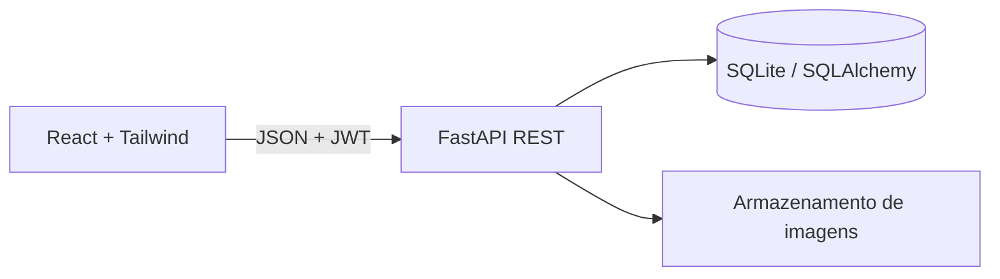
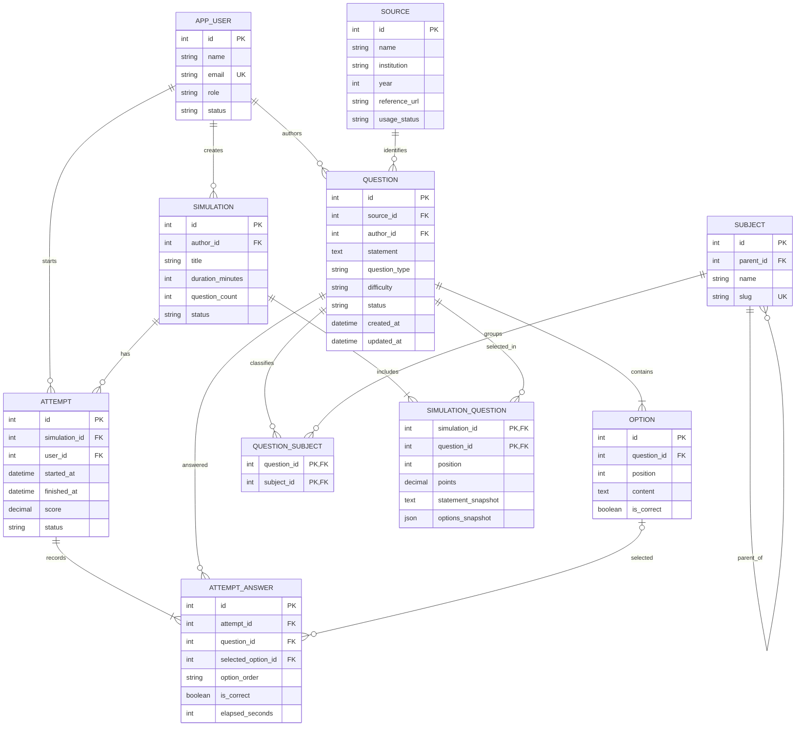
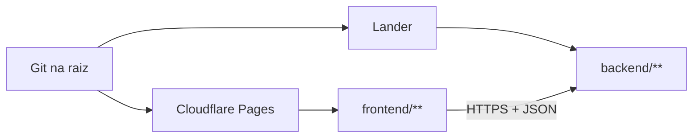

# Banco de Questões

Arquitetura proposta para uma plataforma de questões de múltipla escolha, com suporte a questões autorais ou importadas de provas, catalogação por tema e geração de simulados.

## 1. Visão geral



O frontend não acessa o SQLite diretamente. A API é a fronteira única para autenticação, autorização, validação, filtros e regras de montagem de simulados. SQLite atende bem ao início do projeto e mantém o desenvolvimento simples; a camada de persistência deve continuar compatível com PostgreSQL para uma futura implantação multiusuário.

## 2. Organização do repositório

```text
.
├── backend/
│   ├── app/
│   │   ├── main.py                 # criação da aplicação FastAPI
│   │   ├── core/                   # configuração, segurança e dependências
│   │   ├── db/                     # engine, sessão e migrações Alembic
│   │   ├── models/                 # entidades SQLAlchemy
│   │   ├── schemas/                # contratos Pydantic de entrada/saída
│   │   ├── repositories/           # consultas e filtros de persistência
│   │   ├── services/               # regras de negócio
│   │   └── api/routes/              # endpoints REST versionados
│   ├── tests/
│   └── pyproject.toml
├── frontend/
│   ├── src/
│   │   ├── app/                    # rotas e providers
│   │   ├── components/             # componentes visuais reutilizáveis
│   │   ├── features/questions/     # cadastro, busca e revisão
│   │   ├── features/simulations/   # montagem e execução de simulados
│   │   └── lib/api.ts              # cliente HTTP tipado
│   └── package.json
└── frontend/index.html             # protótipo estático atual
```

## 3. Modelo de dados

### Entidades principais

- `User`: usuário, perfil (`admin`, `editor`, `student`) e status.
- `Source`: origem da questão, como autoria própria, concurso, instituição, cargo e ano. Guarda a referência bibliográfica e o status de direitos de uso.
- `Subject`: árvore de assuntos. Exemplo: `Tecnologia > Banco de Dados > SQL > Joins`.
- `Question`: enunciado, tipo (`single_choice`), dificuldade, status (`draft`, `published`, `archived`), origem, autor e timestamps.
- `Option`: alternativas ordenadas, com texto e indicador da correta. A API deve garantir exatamente uma alternativa correta para uma questão publicada.
- `QuestionSubject`: associação N:N entre questões e assuntos.
- `Simulation`: configuração do simulado, título, tempo, quantidade, autor e status.
- `SimulationQuestion`: questões do simulado, ordem e pontuação. Mantém um snapshot do texto e das alternativas para que uma edição posterior não altere uma prova já aplicada.
- `Attempt` e `AttemptAnswer`: tentativa do aluno, respostas, tempo, acerto e nota.

### Diagrama entidade-relacionamento



`QUESTION_SUBJECT` resolve a relação muitos-para-muitos entre questões e assuntos. `SIMULATION_QUESTION` conserva o conteúdo apresentado no momento da aplicação; `ATTEMPT_ANSWER` conserva a ordem embaralhada e a resposta escolhida, permitindo corrigir e auditar uma tentativa sem depender de alterações posteriores na questão.

### Regras de integridade

1. Uma questão publicada deve possuir 4 ou 5 alternativas, apenas uma correta e ao menos um assunto.
2. Alternativas têm posição única por questão; a ordem exibida não deve depender do banco.
3. Uma questão arquivada não entra em novos simulados, mas permanece nas tentativas históricas.
4. `Source` é obrigatório para questões importadas e deve registrar a prova de origem; questões autorais usam uma fonte própria.
5. O embaralhamento é feito por tentativa e a ordem apresentada é persistida em `AttemptAnswer`.
6. Exclusão física não é permitida para questões que já participaram de uma tentativa; usar arquivamento.

## 4. API REST v1

### Questões

| Método | Endpoint | Uso |
|---|---|---|
| `GET` | `/api/v1/questions` | Lista paginada com `q`, `subject_id`, `source_id`, `difficulty`, `status` e `page` |
| `POST` | `/api/v1/questions` | Cria questão em rascunho |
| `GET` | `/api/v1/questions/{id}` | Consulta questão e metadados |
| `PATCH` | `/api/v1/questions/{id}` | Edita questão ou muda status |
| `DELETE` | `/api/v1/questions/{id}` | Arquiva quando houver histórico |
| `POST` | `/api/v1/questions/{id}/publish` | Valida e publica |
| `POST` | `/api/v1/questions/import` | Importação em lote com relatório por linha |

### Catálogo

`GET/POST/PATCH /api/v1/subjects`, `GET/POST/PATCH /api/v1/sources` e `GET /api/v1/catalog/summary` atendem a árvore de assuntos, origens e indicadores do painel.

### Simulados e tentativas

| Método | Endpoint | Uso |
|---|---|---|
| `POST` | `/api/v1/simulations` | Cria simulado manual ou por filtros |
| `GET` | `/api/v1/simulations` | Lista simulados disponíveis |
| `GET` | `/api/v1/simulations/{id}` | Retorna configuração e questões |
| `POST` | `/api/v1/simulations/{id}/attempts` | Inicia tentativa e congela a ordem |
| `PATCH` | `/api/v1/attempts/{id}/answers/{question_id}` | Salva resposta progressivamente |
| `POST` | `/api/v1/attempts/{id}/finish` | Finaliza, corrige e calcula desempenho |
| `GET` | `/api/v1/attempts/{id}/result` | Resultado, gabarito e explicações permitidas |

As respostas de uma tentativa não devem expor `is_correct` antes da finalização. A operação de finalização precisa ser idempotente.

## 5. Fluxos de negócio

### Cadastro e publicação

1. Editor informa enunciado, 4 ou 5 alternativas, resposta correta, explicação, assunto, dificuldade e origem.
2. A API salva como `draft` e executa validações de domínio.
3. O editor visualiza a prévia e publica.
4. O catálogo passa a incluir a questão apenas quando o status é `published`.

### Geração de simulado

O serviço `SimulationBuilder` recebe filtros, quantidade e estratégia (`random`, distribuição por assunto ou seleção manual). Ele verifica se há questões suficientes, seleciona IDs sem repetição, cria a configuração e grava a ordem no momento em que a tentativa é iniciada.

## 6. Segurança e operação

- JWT de curta duração com refresh token; perfis controlam cadastro, publicação e aplicação.
- ORM com consultas parametrizadas e validação Pydantic; nunca concatenar filtros recebidos do cliente.
- CORS restrito aos domínios do frontend.
- Migrações Alembic desde a primeira versão, mesmo usando SQLite.
- Testes de serviço para publicação, geração de simulados e correção; testes de rota para contratos HTTP.
- `created_at`, `updated_at` e auditoria de alterações em questões publicadas.
- Backup periódico do arquivo SQLite e diretório de imagens; em produção, migrar para PostgreSQL e armazenamento de objetos.

## 7. Decisões de frontend

O frontend deve ter três áreas principais: **Catálogo**, para filtrar e revisar questões; **Editor**, para criar ou importar questões; e **Simulados**, para montar, aplicar e acompanhar resultados. React Router organiza as telas, TanStack Query gerencia cache e estados de carregamento, e Tailwind mantém o visual consistente. O protótipo em `frontend/index.html` pode ser usado como referência de fluxo de aplicação até a migração para esses módulos.

## 8. Primeiro incremento recomendado

1. Implementar `Subject`, `Source`, `Question` e `Option` com migração inicial.
2. Entregar CRUD de questões e publicação com testes.
3. Adicionar busca paginada por assunto, origem e dificuldade.
4. Implementar `Simulation`, `Attempt` e correção.
5. Migrar as questões existentes do protótipo por um comando de importação idempotente.

## 9. Monorepo e implantação

O Git deve ficar somente na raiz do projeto. Backend e frontend são aplicações independentes dentro do mesmo repositório, com dependências, testes e comandos de build próprios:

```text
.
├── backend/       # publicado no Lander
├── frontend/      # publicado no Cloudflare Pages
├── database/      # schema, seed e documentação; não contém o banco de produção
├── ARCHITECTURE.md
└── .gitignore
```

### Publicação no Lander

Configure o serviço para apontar o diretório `backend/` como raiz de build e iniciar a aplicação com um comando equivalente a:

```bash
uvicorn app.main:app --host 0.0.0.0 --port $PORT
```

O comando exato depende do tipo de serviço oferecido pelo Lander. As variáveis de ambiente devem ser cadastradas no painel do Lander, nunca no Git:

```env
ENVIRONMENT=production
DATABASE_URL=sqlite:////var/lib/bancoquestoes/bancoquestoes.db
JWT_SECRET_KEY=<valor-secreto>
CORS_ORIGINS=https://app.exemplo.com
```

O arquivo SQLite deve estar em um volume persistente do Lander. Sem volume persistente, um redeploy pode apagar os dados. Para múltiplos processos ou crescimento da aplicação, substitua SQLite por PostgreSQL mantendo os modelos e repositórios da API.

### Publicação no Cloudflare Pages

Configure o projeto Pages para usar o mesmo repositório, mas com estas propriedades:

- **Root directory:** `frontend`
- **Build command:** `npm ci && npm run build`
- **Output directory:** `dist`
- **Variável de build:** `VITE_API_URL=https://api.exemplo.com`

Ambientes do frontend:

```text
Desenvolvimento: VITE_API_URL=http://127.0.0.1:8000
Produção:        VITE_API_URL=https://bancodequestoes.rodrigoatique.workers.dev
```

Os arquivos `frontend/.env.example` e `frontend/.env.production.example` registram esses valores. No Cloudflare Pages, cadastre `VITE_API_URL` em **Settings > Environment variables > Production** e faça um novo deploy, pois variáveis `VITE_*` são incorporadas durante o build. Essa configuração deve ser feita no projeto **Pages**, em **Workers & Pages > Pages**, e não em um Worker criado como "static assets only".

Se o frontend tiver sido criado como Worker de ativos estáticos, há duas opções:

1. Recomendada: crie ou converta o deploy para um projeto Cloudflare Pages, com root `frontend`, build `npm ci && npm run build` e saída `dist`. Depois adicione `VITE_API_URL` nas variáveis de ambiente do Pages.
2. Alternativa: mantenha o Worker estático e defina a URL no próprio comando de build: `VITE_API_URL=https://api-do-render.onrender.com npm run build`. Nesse caso, não tente adicionar uma variável runtime ao Worker, porque o valor já será embutido no JavaScript gerado.

O frontend chama somente a URL pública da API. Não coloque `DATABASE_URL`, `JWT_SECRET_KEY` ou qualquer segredo no frontend: variáveis `VITE_*` ficam embutidas no JavaScript entregue ao navegador. O domínio usado em `VITE_API_URL` deve ser realmente o domínio do serviço FastAPI no Render; se `bancodequestoes.rodrigoatique.workers.dev` for apenas o domínio do frontend, substitua-o pela URL `onrender.com` da API.

### Git e deploy independente

O mesmo commit pode disparar dois deploys independentes:



Cada plataforma deve filtrar alterações pelo diretório correspondente, quando essa opção existir. Assim, uma alteração apenas em `frontend/` não precisa reconstruir a API, mas ambos continuam compartilhando histórico, revisão de código e tags no mesmo Git.

### Regras do fluxo de trabalho

1. Versione `backend/`, `frontend/`, `database/schema.sql`, `database/seed.sql` e documentação no Git.
2. Não versione `.env`, tokens, certificados, `node_modules`, `.venv` ou o banco SQLite de produção.
3. Use `database/schema.sql` apenas para desenvolvimento inicial; em produção, use Alembic para migrações incrementais.
4. O deploy da API deve executar migrações antes de disponibilizar a nova versão.
5. Configure CORS na API para aceitar somente os domínios reais do Cloudflare Pages.
6. Use ambientes separados para desenvolvimento, homologação e produção, com bancos e segredos distintos.
7. Proteja a branch principal com revisão e checks de backend e frontend antes do merge.

### Scripts recomendados na raiz

```bash
# Desenvolvimento
uv venv backend/.venv
source backend/.venv/bin/activate
uv pip install --python backend/.venv/bin/python -e backend
npm --prefix frontend install

# Verificações antes do merge
pytest backend/tests
npm --prefix frontend run build
```

O diretório raiz continua sendo a unidade de versionamento; `backend` e `frontend` são apenas unidades de execução e implantação.